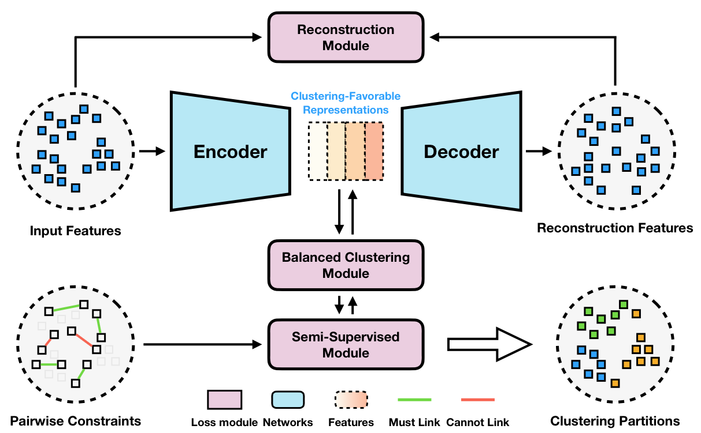
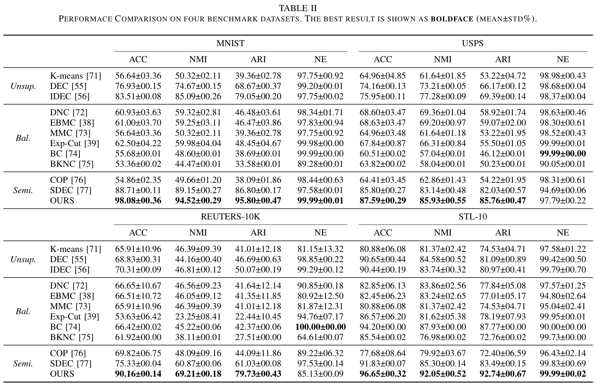

# Towards Balance Deep Semi-supervised Clustering



The goal of balanced clustering is partitioning data into distinct groups of equal size. Previous studies have attempted to address this problem by designing balanced regularizers or utilizing conventional clustering methods. However, these methods often rely solely on classic methods, which limits their performance and primarily focuses on low-dimensional data. Although neural networks exhibit effective performance on high-dimensional datasets, they struggle to effectively leverage prior knowledge for clustering with a balanced tendency. To overcome the above limitations, we propose Deep Semi-supervised Balanced Clustering, which simultaneously learns clustering and generates balance-favorable representations. Our model is based on the autoencoder paradigm incorporating a semi-supervised module. Specifically, we introduce a balance-oriented clustering loss and incorporate pairwise constraints into the penalty term as a pluggable module using the Lagrangian multiplier method. Theoretically, we ensure that the proposed model maintains a balanced orientation and provides a comprehensive optimization process. Empirically, we conduct extensive experiments on four datasets to demonstrate significant improvements in clustering performance and balanced measurements.

## Running

**Train the model**:

```
python semi_bal.py --dataset $DATASET_NAME
```

## Experimental Results
Our results on  whole four datasets:


## License

This project is licensed under the MIT License - see the [LICENSE](LICENSE) file for details.